# Part 1 Methodology

## Research Unit

The target unit is one company-year for each required company from 2016 through 2024. The master target grid contains exactly 450 rows, including explicit records for missing or unusable observations.

## Eligible Pages

Eligible pages are official parent-company pages primarily describing corporate identity, mission, purpose, or values. The preference hierarchy is:

1. mission, purpose, or values page
2. corporate About Us or Who We Are page
3. equivalent corporate overview page

Product, subsidiary, careers, newsroom, campaign, and third-party pages are excluded. Multiple historical URLs may represent the same page function, but every transition must be documented.

## Annual Snapshot Rule

For each eligible candidate and target year, select the usable HTML capture closest to June 30 at 12:00 UTC. Ties prefer the earlier capture, then the lexicographically earlier original URL.

Captures from adjacent years are never substituted. If no usable target-year capture exists, the row remains non-usable with a structured gap reason.

## Acquisition

CDX queries retain timestamp, original URL, status code, MIME type, digest, and content length. Broad discovery metadata is retained before replay retrieval. Collection is resumable and every target company-year receives a status.

The CDX query implementation follows the Internet Archive Wayback CDX Server API documentation.
It uses exact URL lookup first, then `matchType=prefix` only as a documented fallback when exact
matching returns no captures for the candidate-year. Query strategy and request metadata are written
to `data/processed/cdx_query_log.csv`.

## Data Collection Workflow

The final collection pipeline is fully scripted. Each stage writes auditable metadata, hashes,
status fields, or review records so every final company-year row can be traced back to an official
candidate URL, a Wayback CDX query result, and a replay/extraction decision.

```mermaid
flowchart LR
    A["Reviewed company manifest<br>50 firms with sector labels"] --> B["Build target grid<br>50 companies x 2016-2024"]
    B --> C["Load reviewed page registry<br>mission, purpose, values, about, overview"]
    C --> D["Query Wayback CDX<br>exact URL by candidate-year"]
    D --> E{"Same-year<br>captures found?"}
    E -- "No" --> F["Try documented fallbacks<br>prefix CDX and availability API"]
    E -- "Yes" --> G["Rank annual captures<br>page semantics + June 30 distance"]
    F --> G
    G --> H{"Replayable<br>HTML candidate?"}
    H -- "No" --> I["Record explicit gap<br>no CDX or no eligible capture"]
    H -- "Yes" --> J["Fetch Wayback replay<br>id_, if_, bare replay variants"]
    J --> K{"Replay<br>retrieved?"}
    K -- "No" --> L["Retry and alternate-capture recovery<br>preserve failed attempt log"]
    L --> J
    K -- "Yes" --> M["Extract visible text<br>HTML parser + trafilatura fallback"]
    M --> N["Compute hashes and QA flags<br>word count, alpha, link ratio"]
    N --> O{"Usable<br>substantive text?"}
    O -- "No" --> P["Record non-usable row<br>retrieval or extraction reason"]
    O -- "Yes" --> Q["Analyze text<br>themes, linguistic metrics, changes"]
    I --> R["Final 450-row dataset<br>explicit statuses and gap reasons"]
    P --> R
    Q --> R
    R --> S["Coverage, validation, and review outputs<br>summary, audits, review decisions"]
```

## Pipeline Evolution

The initial pipeline was intentionally conservative: it used a hand-reviewed registry of official
corporate pages, queried same-year Wayback CDX captures, selected the successful HTML capture
nearest June 30 at 12:00 UTC, extracted visible text with a structural HTML parser, and recorded
non-usable rows as explicit gaps rather than imputing text.

Coverage testing exposed three failure modes. First, exact CDX lookup missed historical redirects
and legacy URL structures. The pipeline was extended with documented `matchType=prefix` fallback,
Wayback availability fallback, year-level query caching, and `cdx_query_log.csv` audit records.
Second, some selected captures were technically replayable but were low-value subpages such as
awards, refineries, research labs, officers, or governance pages. Annual ranking now gives priority
to mission, values, purpose, who-we-are, company-overview, and broad about pages before applying
the June 30 distance rule. Third, replay/extraction failed on malformed archived HTML, JavaScript
shells, and transient Wayback network errors. The replay stage now tries `id_`, `if_`, and bare
Wayback variants, preserves failed attempt logs, can recover through alternate same-year captures,
and records extraction provenance. The extractor also uses a controlled `trafilatura` fallback when
the structural parser returns too little text.

Additional recovery passes added narrowly scoped historical URL seeds only when they could still be
verified through official Wayback CDX/replay evidence. These additions improved coverage, but the
final dataset keeps remaining failures as auditable gaps. Short-but-substantive pages can be usable;
empty pages, `Loading...` shells, error pages, low-alpha text, and text below the minimum usable-word
floor remain non-usable.

## Extraction

Archived HTML is parsed structurally. Scripts, styles, forms, navigation, footers, cookie notices, and common archive boilerplate are removed. The pipeline preserves substantive headings and paragraphs, records content hashes and text metrics, and flags suspicious results for manual review. Short text, high link-text ratio, or missing semantic main/article regions are treated as review signals, not automatic exclusion rules; rows become non-usable only for empty/error-like/low-alpha extraction, failed replay retrieval, or extremely thin text below the minimum usable-word floor.

## Change Detection

Change is calculated only from cleaned substantive text for adjacent calendar years. The pipeline retains exact match, continuous similarity, word-count change, representative additions/removals, and an interpretable change class. If either adjacent year is unusable, `changed_from_prior` is null.

## Theme, Linguistic, and LLM Analysis

The reproducible baseline uses a fixed, multi-label taxonomy with evidence-backed phrase rules and deterministic linguistic metrics. Theme classifications retain evidence and salience. An LLM-assisted structured classifier can be added when credentials are available, but no LLM result is claimed unless model, prompt, and run metadata are recorded.

The current Part 1 run adds a separate local LLM layer using cached `Qwen/Qwen3-1.7B` through the
causal-chat path in Transformers. This model was selected as the strongest practical local option
for the 16 GB M1 Pro environment: larger Qwen models are likely to require quantization or external
compute for full-panel analysis, while FLAN-small produced weaker and less structured notes. The
Qwen run uses greedy decoding on Apple MPS, strips hidden-reasoning wrappers, and reads the final
450-row panel. It generates snapshot-level notes for all 358 usable observations and adjacent-year
change notes for the 299 company-year pairs where both the current and prior rows are usable. It
writes prompt hashes, input text hashes, response hashes, package versions, model parameters,
device, and quality flags to `outputs/llm_analysis/`. These annotations are treated as audit
triangulation rather than as replacements for the deterministic theme/change fields.

## Validation

Each phase has automated tests. The final pipeline also produces:

- a 450-row requirement audit
- coverage and failure summaries
- extraction/gap review decisions
- extraction and change QA flags
- evidence-backed theme observations
- local LLM analysis manifest and quality flags

Manual corrections must be recorded rather than silently overwriting generated values.
