# Part 2 Methodology

## Document Type

The selected document type is SEC `DEF 14A` proxy statements.

This choice prioritizes reproducibility, coverage, and auditability. EDGAR filings are official
public records, available without paid APIs, and expose stable CIK, accession, filing date, and
archive URL metadata. The tradeoff is construct validity: proxy statements reveal disclosed
governance, compensation, voting, and board priorities. They do not directly prove lived behavior.

## Collection Source

The pipeline uses free SEC endpoints:

- ticker to CIK map: `https://www.sec.gov/files/company_tickers.json`
- submissions history: `https://data.sec.gov/submissions/CIK##########.json`
- primary documents: `https://www.sec.gov/Archives/edgar/data/...`

The runner uses a declared User-Agent and configurable request delay to respect SEC fair-access
expectations.

## Data Collection Workflow

The collection workflow is fully scripted and auditable. Each stage writes structured metadata,
status fields, hashes, or logs so the final dataset can be traced back to official SEC sources.

```mermaid
flowchart LR
    A["Part 1 company list<br>50 firms with sector labels"] --> B["Build Part 2 target grid<br>50 companies x 2016-2024 = 450 rows"]
    B --> C["Resolve ticker to SEC CIK<br>free SEC company_tickers.json"]
    C --> D["Fetch SEC submissions metadata<br>CIK JSON"]
    D --> E{"Calendar-year DEF 14A found?"}
    E -- "No" --> F["Record documented gap<br>status = missing<br>reason = no_def14a_filing_for_calendar_year"]
    E -- "Yes" --> G["Select first calendar-year DEF 14A<br>store accession, filing date, archive URL"]
    G --> H["Download primary filing document<br>SEC Archives"]
    H --> I["Save raw artifact<br>data/raw/filings<br>raw SHA256 hash"]
    I --> J["Extract visible filing text<br>HTML parsing and cleanup"]
    J --> K["Save clean text artifact<br>data/processed/text<br>clean SHA256 hash"]
    K --> L{"Extraction quality screen"}
    L -- "Usable" --> M["Create collected company-year row<br>source metadata + text metrics"]
    L -- "Low quality" --> N["Keep status and quality reason<br>do not impute"]
    F --> O["Collection status tables<br>coverage, missingness, logs"]
    M --> O
    N --> O
    O --> P["Final collection dataset<br>outputs/part2_company_year_compact.csv"]
```

## Selection Rule

For each company-year, the pipeline selects the first calendar-year `DEF 14A` filing in the SEC
submissions history. `DEFA14A` supplemental filings are not used by default because the assignment
asks for one comparable document type.

## Text Extraction

Downloaded primary documents are stored under `data/raw/filings/`. Clean text is extracted from
visible HTML text and stored under `data/processed/text/`. Every raw and clean artifact receives a
SHA256 hash.

Extraction quality is coded as:

- `usable`: at least 1,000 words and not obviously index-only.
- `insufficient_text`: non-empty text below the threshold.
- `possibly_index_only`: table-of-contents-heavy text below the stricter screen.
- `empty`: no extractable words.

## Analysis

Part 2 applies the same fixed theme IDs used in Part 1 taxonomy version
`1.0.0-keyword-baseline`, plus deterministic linguistic metrics. This creates a shared
representation for Part 3 alignment analysis.

### Theme and Tone Classification

The baseline classifier uses two auditable dictionaries. Theme classification captures what topic
the filing language emphasizes. Tone/language classification captures how the filing speaks.
Both are deterministic keyword/phrase counts, not supervised model predictions.

Theme matches are assigned with the following Part 1-compatible categories:

| Theme ID | Label | Matching terms |
| --- | --- | --- |
| `customers_and_service` | Customers and service | `customer`; `customers`; `customer experience`; `client`; `clients`; `consumer`; `consumers`; `patient`; `patients`; `service` |
| `employees_and_workplace` | Employees and workplace | `employee`; `employees`; `our people`; `workforce`; `talent`; `workplace`; `professional development`; `career development` |
| `innovation_and_excellence` | Innovation and excellence | `innovation`; `innovative`; `invent`; `excellence`; `quality`; `continuous improvement`; `best in class` |
| `integrity_and_ethics` | Integrity and ethics | `integrity`; `ethical`; `ethics`; `honesty`; `honest`; `trust`; `transparent`; `transparency` |
| `diversity_equity_and_inclusion` | Diversity, equity, and inclusion | `diversity`; `diverse`; `equity`; `inclusion`; `inclusive`; `belonging`; `equal opportunity` |
| `social_impact_and_community` | Social impact and community | `community`; `communities`; `social impact`; `society`; `philanthropy`; `volunteer`; `giving back` |
| `environment_and_sustainability` | Environment and sustainability | `sustainability`; `sustainable`; `environment`; `environmental`; `climate`; `emissions`; `renewable`; `natural resources` |
| `health_safety_and_wellbeing` | Health, safety, and wellbeing | `health`; `healthy`; `safety`; `safe`; `wellbeing`; `well-being`; `security` |
| `shareholders_and_performance` | Shareholders and performance | `shareholder`; `shareholders`; `shareholder value`; `financial performance`; `profitable growth`; `long-term value`; `returns` |
| `leadership_and_accountability` | Leadership and accountability | `leadership`; `leader`; `leaders`; `accountability`; `accountable`; `ownership`; `responsibility`; `responsible` |
| `collaboration_and_partnership` | Collaboration and partnership | `collaboration`; `collaborate`; `teamwork`; `partnership`; `partnerships`; `together` |
| `purpose_and_identity` | Purpose and identity | `our purpose`; `our mission`; `our values`; `core values`; `who we are`; `we exist to`; `our vision` |

For each matched theme, the dataset stores the theme ID, matched phrases, match count, and short
evidence excerpts. Analysis outputs normalize theme emphasis as matches per 10,000 words so long
proxy statements do not dominate raw counts.

Tone and language indicators are measured with the following lexical categories:

| Indicator | Interpretation | Matching terms |
| --- | --- | --- |
| `first_person_plural` | Collective organizational voice | `we`; `our`; `ours`; `us` |
| `commitment` | Obligation or commitment stance | `will`; `must`; `commit`; `committed`; `promise`; `pledge` |
| `aspiration` | Goal-seeking or aspirational stance | `aim`; `aims`; `aspire`; `seek`; `strive`; `hope`; `vision` |
| `action_or_evidence` | Completed action or evidence-oriented language | `achieved`; `delivered`; `launched`; `reduced`; `increased`; `invest`; `invested`; `created`; `implemented` |
| `stakeholder` | Stakeholder-facing orientation | `customer`; `customers`; `employee`; `employees`; `community`; `communities`; `supplier`; `suppliers` |

The tone metrics are reported as counts and rates per 100 words. The pipeline also records average
sentence length and quantified-claim counts. These indicators are lexical style proxies; they are
not sentiment scores and should not be read as direct measures of sincerity or behavior.

### References

This Part 2 classifier follows the logic of dictionary-based content analysis: define a transparent
codebook, apply it consistently to a corpus, keep evidence for positive assignments, and interpret
counts within the limits of the document genre. This is consistent with standard content-analysis
methodology, where the validity of categories depends on explicit coding rules, reproducibility,
and careful interpretation rather than opaque model inference. See Krippendorff's work on content
analysis and coding reliability, including "Reliability in Content Analysis" and *Content Analysis:
An Introduction to Its Methodology*.

The theme taxonomy is a deductive values-disclosure codebook rather than an unsupervised discovery
model. Its categories map onto common constructs in stakeholder, CSR, and sustainability research:
customers, employees, communities, shareholders, ethical conduct, diversity/inclusion, environment,
safety, leadership/accountability, collaboration, innovation, and organizational purpose. The
stakeholder orientation follows the broader stakeholder-theory tradition associated with Freeman's
*Strategic Management: A Stakeholder Approach*. The CSR and sustainability dimensions are also
consistent with review and corporate-sustainability work that treats firms as addressing both
internal and external stakeholders, social responsibility, governance, and nonfinancial disclosure
practices, including Aguinis and Glavas (2012) and Eccles, Ioannou, and Serafeim (2014).

The tone/language metrics follow the tradition of computerized lexical analysis associated with
LIWC-style methods. Tausczik and Pennebaker (2010) emphasize that word categories can be used to
measure both content and style, including pronouns and other linguistic markers. In this project,
`first_person_plural` is therefore used as a proxy for collective organizational voice, while
commitment, aspiration, action/evidence, and stakeholder terms are treated as auditable lexical
signals of disclosure stance. The project intentionally avoids claiming that these terms reveal
psychological sincerity.

For corporate filings specifically, the method also follows the caution from Loughran and McDonald
(2011): general dictionaries can misclassify financial and legal disclosure language, so dictionary
categories must be domain-aware and interpreted in context. For this reason, the analysis does not
use a generic positive/negative sentiment dictionary. It uses narrow, inspectable word lists, keeps
matched phrase evidence, normalizes rates by document length, and flags large shifts for excerpt
audit.

- Aguinis, H., & Glavas, A. (2012). "What We Know and Don't Know About Corporate Social
  Responsibility: A Review and Research Agenda." *Journal of Management*, 38(4), 932-968.
  https://doi.org/10.1177/0149206311436079
- Carroll, A. B. (1991). "The Pyramid of Corporate Social Responsibility: Toward the Moral
  Management of Organizational Stakeholders." *Business Horizons*, 34(4), 39-48.
- Eccles, R. G., Ioannou, I., & Serafeim, G. (2014). "The Impact of Corporate Sustainability on
  Organizational Processes and Performance." *Management Science*, 60(11), 2835-2857.
  https://doi.org/10.1287/mnsc.2014.1984
- Freeman, R. E. (1984). *Strategic Management: A Stakeholder Approach*. Boston: Pitman.
- Krippendorff, K. (2004). "Reliability in Content Analysis." *Human Communication Research*,
  30(3), 411-433. https://doi.org/10.1111/j.1468-2958.2004.tb00738.x
- Loughran, T., & McDonald, B. (2011). "When Is a Liability Not a Liability? Textual Analysis,
  Dictionaries, and 10-Ks." *The Journal of Finance*, 66(1), 35-65.
  https://doi.org/10.1111/j.1540-6261.2010.01625.x
- Tausczik, Y. R., & Pennebaker, J. W. (2010). "The Psychological Meaning of Words: LIWC and
  Computerized Text Analysis Methods." *Journal of Language and Social Psychology*, 29(1), 24-54.
  https://doi.org/10.1177/0261927X09351676

An enhanced model-checking module is also provided as an exploratory layer whose outputs are stored
separately for audit, while the interpretation is merged into `docs/text_mining_analysis.md`. It
uses free, open-source tooling managed by the shared root `uv` environment:

- scikit-learn TF-IDF + NMF topic modeling with fixed `random_state=42`.
- `sentence-transformers/all-MiniLM-L6-v2` embeddings with normalized document vectors.
- spaCy `en_core_web_sm` statistical features.
- sampled local `google/flan-t5-small` annotations with seed, temperature, prompt hash, excerpt
  hash, response hash, and quality flags.

These model-based outputs are deliberately stored under `outputs/text_mining/enhanced/` and are
not used as substitutes for the deterministic phrase-evidence baseline. The local LLM annotations
are marked `needs_human_review`; in this run, most were fragmentary or boilerplate-like, so they
are retained as an audit trail rather than used as substantive evidence.

## Audit Strategy

Automated collection is the production path. Human work is reserved for audit:

- review non-collected and low-quality rows
- inspect a sample of successful rows
- verify that selected documents are true proxy statements
- avoid treating disclosure language as direct behavioral evidence
