# Part 2 Text Mining Analysis

## Research Design and Method

Part 2 analyzes SEC `DEF 14A` proxy statements as a free, official, and reproducible disclosure
source. The full run covers 434 of 450 company-years
(96.44%). The remaining 16 rows are retained as
documented gaps and are not imputed.

The analysis has two layers. The main evidentiary layer is deterministic: Part 1-compatible theme
matching, literal phrase evidence, document-length-normalized rates, and descriptive linguistic
metrics. This layer carries the main claims because it is transparent, reproducible, and easy to
audit.

A second, exploratory layer adds open-source model-based checks: TF-IDF/NMF topic modeling,
MiniLM sentence embeddings, spaCy features, and a sampled local FLAN-T5 annotation pass. These
model outputs are used for triangulation, construct-validity checks, and audit triage; they do not
replace the deterministic phrase-evidence baseline. I did not use a paid API or closed model.

I treat `language` as the vocabulary and phrase emphasis captured by the theme taxonomy, and `tone`
as observable disclosure style: collective voice, commitment language, aspirational language,
action/evidence language, stakeholder orientation, sentence length, and quantified claims. These
are lexical proxies rather than psychological sentiment scores, which is more appropriate for legal
proxy filings.

## 1. Overall Disclosure Priorities

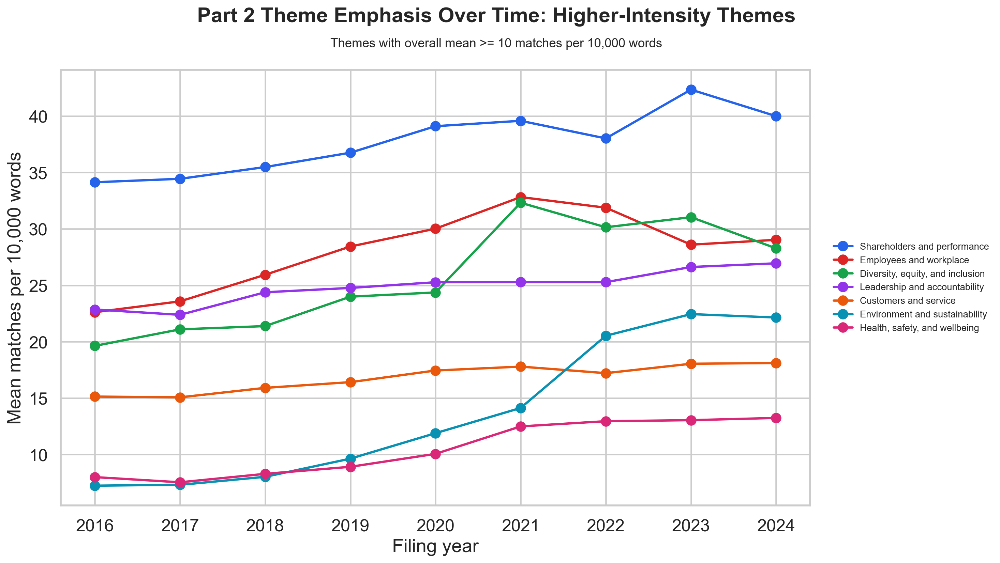

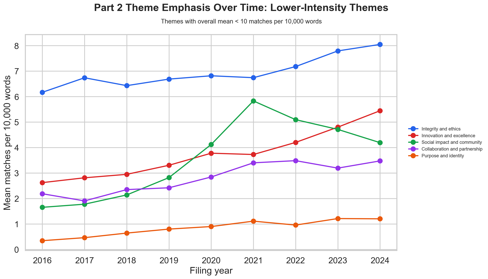

| Theme | Mean matches / 10k words | Presence |
| --- | --- | --- |
| Shareholders and performance | 37.78 | 100.0% |
| Employees and workplace | 28.11 | 100.0% |
| Diversity, equity, and inclusion | 25.82 | 100.0% |
| Leadership and accountability | 24.87 | 100.0% |
| Customers and service | 16.79 | 99.8% |
| Environment and sustainability | 13.72 | 98.8% |
| Health, safety, and wellbeing | 10.50 | 100.0% |
| Integrity and ethics | 6.96 | 100.0% |
| Innovation and excellence | 3.74 | 97.2% |
| Social impact and community | 3.60 | 96.8% |
| Collaboration and partnership | 2.81 | 99.5% |
| Purpose and identity | 0.85 | 74.2% |

The strongest overall signal is not surprising: proxy statements are shareholder-facing governance
documents, so `Shareholders and performance` is the top normalized theme at
37.8 matches per 10,000 words.
What is more substantively useful is that workforce and DEI language are also pervasive. `Employees
and workplace` and `Diversity, equity, and inclusion` appear in every collected company-year and
rank second and third by normalized intensity. This suggests that by 2016-2024, proxy statements
were no longer only compensation and voting documents; they had become a venue for communicating
human-capital and governance identity claims.

The two line charts split the same 12-theme taxonomy by overall intensity. This avoids visually
compressing lower-frequency themes such as purpose/identity, collaboration/partnership, and social
impact/community against the much larger shareholder, workforce, DEI, and leadership series.

## 2. Cross-Sector Comparison

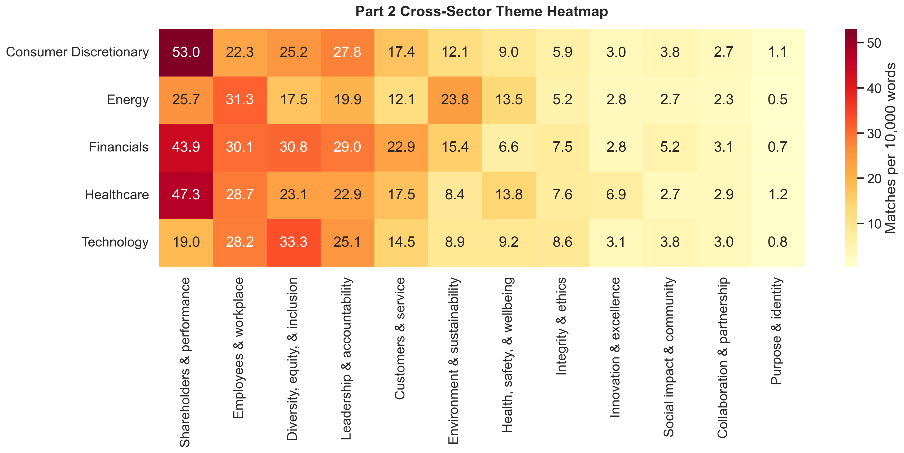

| Sector | Top normalized themes |
| --- | --- |
| Consumer Discretionary | Shareholders and performance (53.0); Leadership and accountability (27.8); Diversity, equity, and inclusion (25.2) |
| Energy | Employees and workplace (31.3); Shareholders and performance (25.7); Environment and sustainability (23.8) |
| Financials | Shareholders and performance (43.9); Diversity, equity, and inclusion (30.8); Employees and workplace (30.1) |
| Healthcare | Shareholders and performance (47.3); Employees and workplace (28.7); Diversity, equity, and inclusion (23.1) |
| Technology | Diversity, equity, and inclusion (33.3); Employees and workplace (28.2); Leadership and accountability (25.1) |

The sector comparison shows both document-type regularity and meaningful heterogeneity.
Consumer discretionary, healthcare, and financial firms are especially shareholder/performance
heavy. Technology is distinctive: its highest normalized theme is DEI at
33.3 matches per 10,000 words. Energy is also distinctive: environment
and sustainability reaches 23.8 matches per 10,000 words, much
higher than the overall mean, but employee/workplace language remains the sector's top category.
These differences are useful for Part 3 because an alignment measure should not treat all sectors
as having the same expected disclosure vocabulary.

## 3. Time and External-Event Window

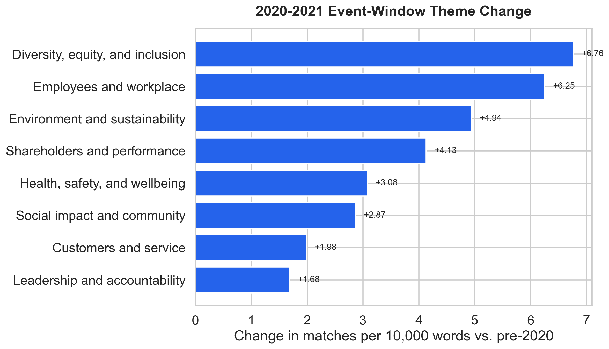

| Theme | Pre-2020 | 2020-2021 | Post-2021 | Window - pre |
| --- | --- | --- | --- | --- |
| Diversity, equity, and inclusion | 21.54 | 28.30 | 29.83 | 6.76 |
| Employees and workplace | 25.15 | 31.40 | 29.83 | 6.25 |
| Environment and sustainability | 8.06 | 12.99 | 21.71 | 4.94 |
| Shareholders and performance | 35.21 | 39.34 | 40.13 | 4.13 |
| Health, safety, and wellbeing | 8.18 | 11.26 | 13.08 | 3.08 |
| Social impact and community | 2.10 | 4.97 | 4.67 | 2.87 |
| Customers and service | 15.63 | 17.61 | 17.79 | 1.98 |
| Leadership and accountability | 23.59 | 25.28 | 26.28 | 1.68 |

The 2020-2021 window shows the clearest descriptive increase in themes tied to workforce, DEI,
sustainability, and stakeholder concern. DEI rises by 6.76 matches per 10,000 words relative to the
pre-2020 period; employee/workplace language rises by 6.25; and environment/sustainability rises by
4.94. These changes are consistent with the COVID-era workforce shock, the post-2020 DEI disclosure
cycle, and growing investor attention to ESG governance. They should not be interpreted as causal
effects: proxy templates, regulatory expectations, and investor norms changed at the same time.

The event interpretation table makes the external-event claim explicit. It links each external
context to the text shift it appears to coincide with, while keeping the causal caveat visible.

| Window | Relevant external event | Observed text shift | Interpretation | Caveat |
| --- | --- | --- | --- | --- |
| 2020-2021 | COVID-era workforce shock | Employees/workplace +6.25; health/safety +3.08 vs. pre-2020 | Proxy language becomes more attentive to workforce continuity, safety, and employee-facing governance. | Descriptive coincidence only; proxy templates and workforce disclosure norms also changed. |
| 2020-2021 | Post-2020 DEI attention | DEI +6.76 vs. pre-2020 | Diversity, equity, and inclusion language becomes more prominent in governance disclosures. | Some DEI matches appear in shareholder proposal or voting mechanics, so excerpt review remains necessary. |
| 2021 onward | Investor attention to ESG governance | Environment/sustainability rises from 8.06 pre-2020 to 21.71 post-2021 | Sustainability language continues increasing after the initial 2020-2021 window. | The evidence supports a timing association, not a causal estimate of ESG pressure. |

## 4. Language and Tone Over Time

The central language-and-tone finding is that proxy disclosures become more stakeholder-facing and
more explicitly organizational in voice over time, but not more action-heavy. This is different from
the theme result. The theme analysis asks *what topics* appear; the tone analysis asks *how the
filings speak* when they discuss governance, human capital, and corporate priorities.

- Collective voice rises from 1.212 to 1.681 markers per 100 words, a roughly 38.6% increase.
- Stakeholder orientation rises from 0.190 in 2016 to a 2021 peak of 0.324, and remains higher in 2024 at 0.265.
- Commitment language declines from 0.355 to 0.306, while action/evidence terms stay low, around 0.08-0.10 markers per 100 words.

Substantively, this means the corpus does not simply add more values topics. It increasingly frames
those topics through an institutional `we/our` voice and a broader stakeholder vocabulary, while
still preserving the cautious, formal style of proxy disclosure.

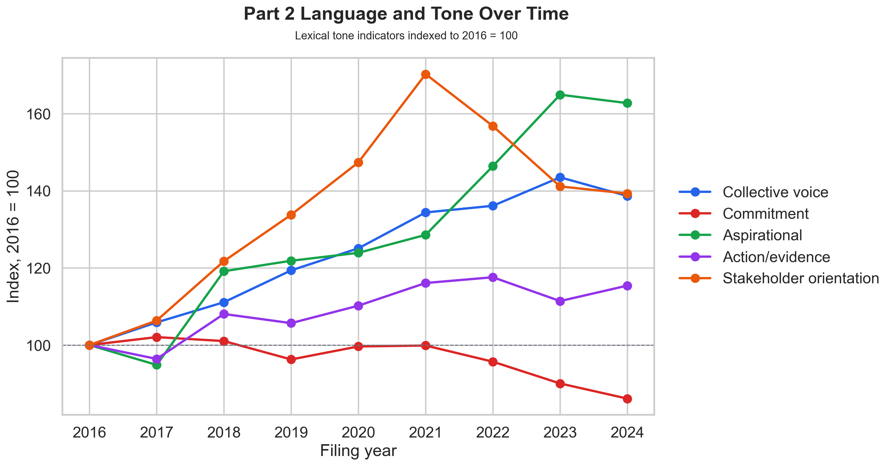

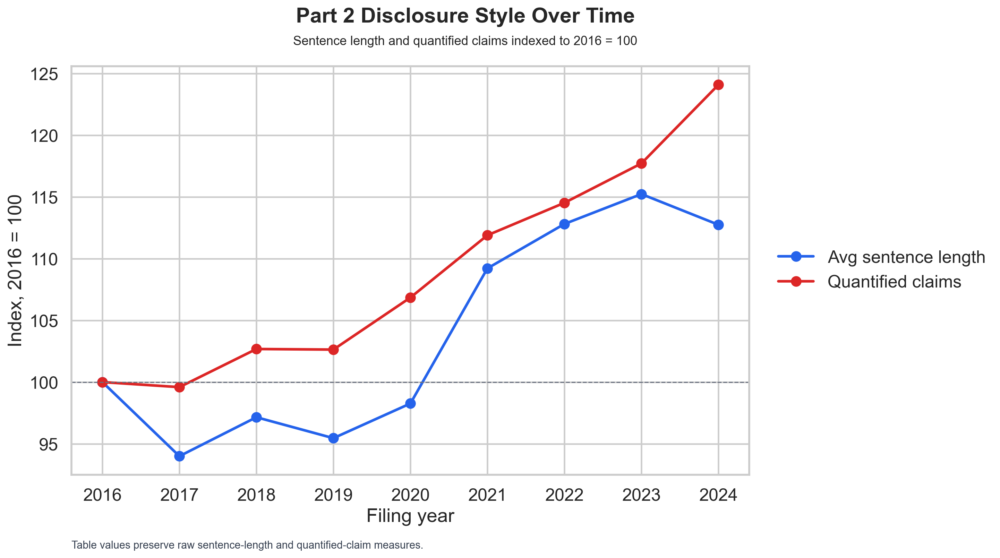

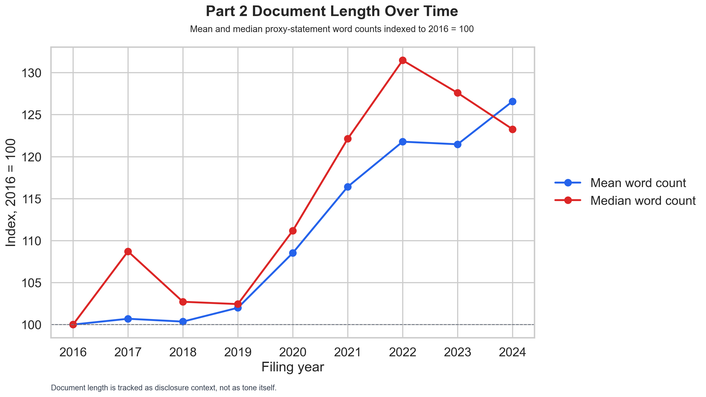

| Year | Mean words | Median words | Collective voice | Commitment | Aspirational | Action/evidence | Stakeholder | Avg sentence length | Quantified claims |
| --- | --- | --- | --- | --- | --- | --- | --- | --- | --- |
| 2016 | 47417 | 43266 | 1.212 | 0.355 | 0.015 | 0.087 | 0.190 | 9.15 | 3012 |
| 2017 | 47744 | 47037 | 1.283 | 0.363 | 0.014 | 0.084 | 0.202 | 8.60 | 3000 |
| 2018 | 47585 | 44441 | 1.347 | 0.359 | 0.018 | 0.094 | 0.232 | 8.89 | 3093 |
| 2019 | 48364 | 44321 | 1.447 | 0.342 | 0.018 | 0.092 | 0.254 | 8.73 | 3092 |
| 2020 | 51461 | 48104 | 1.516 | 0.354 | 0.019 | 0.096 | 0.280 | 8.99 | 3219 |
| 2021 | 55199 | 52838 | 1.629 | 0.355 | 0.019 | 0.101 | 0.324 | 9.99 | 3371 |
| 2022 | 57742 | 56880 | 1.650 | 0.340 | 0.022 | 0.102 | 0.298 | 10.32 | 3450 |
| 2023 | 57595 | 55201 | 1.739 | 0.320 | 0.025 | 0.097 | 0.268 | 10.54 | 3546 |
| 2024 | 60019 | 53332 | 1.681 | 0.306 | 0.025 | 0.101 | 0.265 | 10.31 | 3738 |

The first indexed line chart shows all lexical tone rates used in the analysis: collective voice,
commitment, aspirational language, action/evidence language, and stakeholder orientation. The
second chart separates disclosure style indicators whose raw units are different: sentence length
and quantified claims. The third chart tracks document length as context for interpretation, not
as tone itself. This split preserves full coverage without forcing heterogeneous measures onto one
raw y-axis.

Stakeholder orientation increases most sharply through 2021, consistent with the COVID-era and
post-2020 shift toward workforce, DEI, health/safety, and ESG governance language. Collective voice
rises more steadily across the full window. Commitment language does not show the same increase;
by 2024 it is below its 2016 level. This contrast is important because it suggests a change in
disclosure stance, not just a uniform increase in all positive-sounding values language.

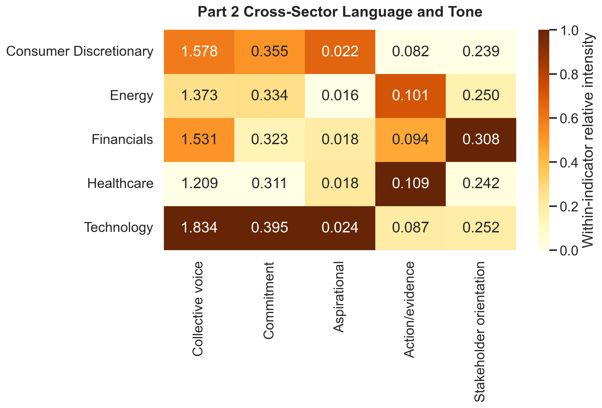

| Sector | Collective voice | Commitment | Aspirational | Action/evidence | Stakeholder | Avg sentence length |
| --- | --- | --- | --- | --- | --- | --- |
| Consumer Discretionary | 1.578 | 0.355 | 0.022 | 0.082 | 0.239 | 10.08 |
| Energy | 1.373 | 0.334 | 0.016 | 0.101 | 0.250 | 9.59 |
| Financials | 1.531 | 0.323 | 0.018 | 0.094 | 0.308 | 9.51 |
| Healthcare | 1.209 | 0.311 | 0.018 | 0.109 | 0.242 | 8.13 |
| Technology | 1.834 | 0.395 | 0.024 | 0.087 | 0.252 | 10.25 |

Sector-level tone also varies. Technology has the strongest collective-voice rate at
1.834 per 100
words and the highest commitment rate at
0.395. Financials have the
highest stakeholder-orientation rate at
0.308. This reinforces the
theme results: sector differences are not only about which topics appear, but also about how firms
style their disclosure voice.

## 5. Within-Company Shifts

| Ticker | Years | Theme | Change / 10k words |
| --- | --- | --- | --- |
| BAC | 2019-2020 | Shareholders and performance | 64.94 |
| BRK.B | 2018-2019 | Environment and sustainability | -49.72 |
| AAPL | 2022-2023 | Shareholders and performance | 45.02 |
| NKE | 2020-2021 | Diversity, equity, and inclusion | 44.76 |
| TMO | 2018-2019 | Shareholders and performance | 44.33 |
| META | 2020-2021 | Shareholders and performance | 40.63 |
| NKE | 2021-2022 | Diversity, equity, and inclusion | -40.12 |
| HAL | 2018-2019 | Shareholders and performance | 39.19 |
| SLB | 2022-2023 | Shareholders and performance | 36.34 |
| VLO | 2021-2022 | Environment and sustainability | 35.26 |

The largest adjacent-year movements should be treated as audit targets rather than final causal
claims. For example, BAC's shareholder/performance language jumps sharply from 2019 to 2020, while
Nike's DEI language rises sharply from 2020 to 2021 and then partially reverses in 2022. These are
exactly the kinds of cases where a researcher should inspect the underlying proxy sections before
making a substantive claim.

A short excerpt audit confirms why this caution matters. BAC's 2019-2020 increase appears driven
substantially by shareholder meeting mechanics, shareholder proposals, proxy access, voting
instructions, and engagement language. By contrast, Nike's 2020-2021 DEI increase is more
substantively connected to diversity/inclusion reporting and board diversity language, though some
matches still come from proposal mechanics. The audit is saved in
`docs/top_shift_excerpt_audit.md` and `outputs/text_mining/top_shift_excerpt_audit.csv`.

## 6. Coverage and Missingness

| Ticker | Sector | Missing years | Count |
| --- | --- | --- | --- |
| AAPL | Technology | 2018 | 1 |
| AVGO | Technology | 2016,2017,2018 | 3 |
| BLK | Financials | 2016,2017,2018,2019,2020,2021,2022,2023,2024 | 9 |
| MCD | Consumer Discretionary | 2022 | 1 |
| SBUX | Consumer Discretionary | 2024 | 1 |
| XOM | Energy | 2021 | 1 |

Coverage is high enough for descriptive text mining, but missingness is not random enough to ignore.
BlackRock accounts for nine of the sixteen gaps, and Broadcom accounts for three. For Part 3, these
company-years should remain missing rather than being assigned zero disclosure emphasis or filled
with sector means.

## 7. Enhanced Model-Based Checks

This section merges the exploratory open-source NLP/modeling layer into the main Part 2 analysis.
It adds TF-IDF/NMF topic modeling, sentence-transformer embeddings, spaCy statistical features, and
a sampled local FLAN-T5 annotation pass on top of the deterministic phrase-evidence baseline.
These outputs are interpretive aids, not replacements for the baseline theme evidence.

The enhanced run covers 434 collected company-years. All parameters,
package versions, model names, seed values, input hashes, and output paths are recorded in
`outputs/text_mining/enhanced/enhanced_text_mining_summary.json`; the JSONL progress log is
`data/interim/enhanced_text_mining_run_log.jsonl`. All stochastic stages use seed
`42` and the input dataset hash is `1422d669d575a15ae005ef4fb9664f5f7d240c4345aac81a37bc7f79e02e42ee`.

Stage status summary:

- TF-IDF/NMF: `completed` with seed `42`.
- Sentence embeddings: `completed` using `sentence-transformers/all-MiniLM-L6-v2`.
- spaCy features: `completed` using `en_core_web_sm`.
- Local LLM annotations: `completed`; sampled outputs are marked with quality
  flags and `needs_human_review`.

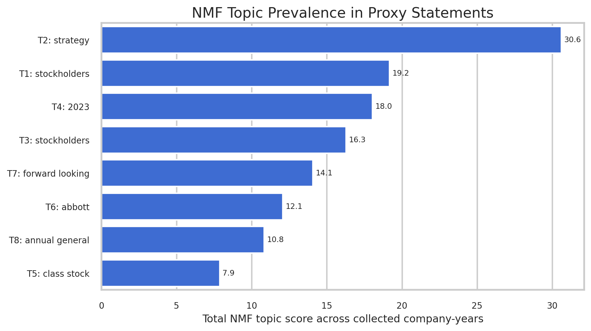

| Topic | Corpus score | Top terms |
| --- | --- | --- |
| T2 | 30.60 | strategy; shareholders; company; billion; commitment; new; strong |
| T1 | 19.17 | stockholders; awards; 2016; 2017; proposal; meeting stockholders; stockholder |
| T4 | 18.03 | 2023; 2022; shareholders; shareholder; virtual; proposal; shareholder proposal |
| T3 | 16.28 | stockholders; meeting stockholders; stockholder; proxy materials; california; internet; stockholder proposal |
| T7 | 14.05 | forward looking; looking statements; statements; looking; forward; differ; actual results |
| T6 | 12.07 | abbott; abbvie; item proxy; abbott laboratories; laboratories; vote approval; item |
| T8 | 10.82 | annual general; general meeting; irish; medtronic; irish statutory; statutory financial; statutory |
| T5 | 7.87 | class stock; berkshire; berkshire hathaway; hathaway; omaha; nebraska; omaha nebraska |

The NMF results deepen the construct-validity reading rather than replacing the baseline. The
highest-scoring topic is not a pure value construct; it mixes strategy, shareholders, company, and
financial scale language. Other topics recover stockholder meeting mechanics, forward-looking
statement boilerplate, annual general meeting language, and company-specific templates. In other
words, in `DEF 14A`, lived-values language is embedded inside governance machinery rather than
presented as a clean cultural manifesto.

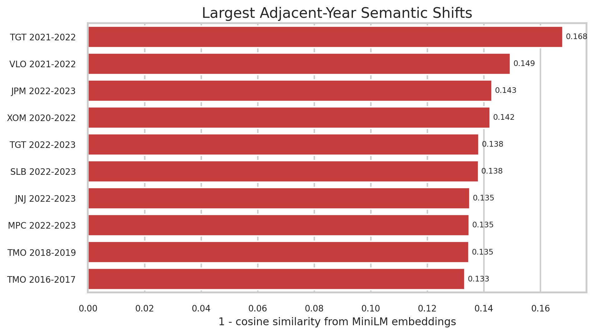

| Ticker | Years | Sector | Semantic distance | Cosine similarity |
| --- | --- | --- | --- | --- |
| TGT | 2021-2022 | Consumer Discretionary | 0.168 | 0.832 |
| VLO | 2021-2022 | Energy | 0.149 | 0.851 |
| JPM | 2022-2023 | Financials | 0.143 | 0.857 |
| XOM | 2020-2022 | Energy | 0.142 | 0.858 |
| TGT | 2022-2023 | Consumer Discretionary | 0.138 | 0.862 |
| SLB | 2022-2023 | Energy | 0.138 | 0.862 |
| JNJ | 2022-2023 | Healthcare | 0.135 | 0.865 |
| MPC | 2022-2023 | Energy | 0.135 | 0.865 |
| TMO | 2018-2019 | Healthcare | 0.135 | 0.865 |
| TMO | 2016-2017 | Healthcare | 0.133 | 0.867 |

The embedding layer is useful as a triage device. Large semantic distances point to filings whose
overall disclosure profile changed enough to justify qualitative review. Target 2021-2022, Valero
2021-2022, and JPMorgan 2022-2023 are the strongest model-identified candidates. These shifts are
not theme labels by themselves; they are pointers to company-year pairs where the surrounding
sections should be read manually.

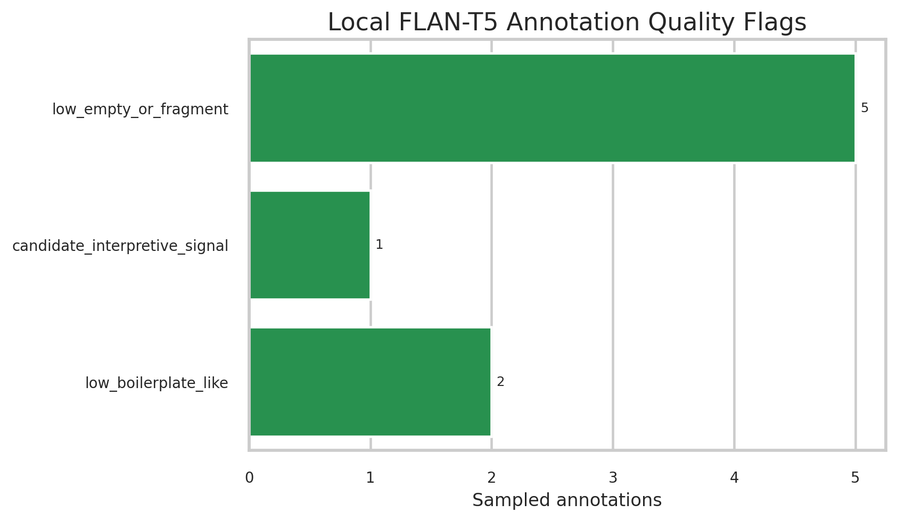

| Quality flag | Count | Share |
| --- | --- | --- |
| candidate_interpretive_signal | 1 | 12.5% |
| low_boilerplate_like | 2 | 25.0% |
| low_empty_or_fragment | 5 | 62.5% |

The local LLM check is most useful as a negative audit result. Although the run is fully logged
with model name, seed, temperature, prompt hash, excerpt hash, and response hash, most sampled
annotations were empty, fragmentary, or boilerplate-like. Only one sampled output was flagged as a
candidate interpretive signal. This means the small local model should not carry any Part 2 claim;
it is retained as a transparent exploratory layer and a warning against over-reading cheap LLM
annotations in legal disclosure text.

For reproducibility, rerun the enhanced stage from the same `uv.lock`, the same input dataset hash,
and the parameters in `enhanced_text_mining_summary.json`. Model downloads are free/open-source but
still depend on package and model availability at rerun time.

## Interpretation

The core empirical takeaway is that proxy statements reveal a structured hierarchy of disclosed
priorities: shareholder/performance language remains dominant, but workforce, DEI, leadership, and
sustainability language are substantial and vary by sector and time. The construct-validity caveat
is central: this is evidence about disclosed priorities in legally structured corporate
communications, not direct evidence of lived organizational behavior.
