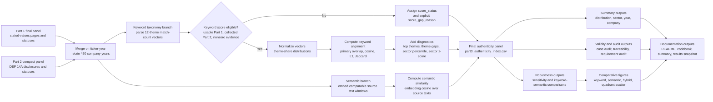

# Part 3 Methodology

## Construct Definition

This part operationalizes organizational authenticity as a disclosure-priority alignment proxy:
the degree to which a company-year's publicly stated values emphasis is mirrored in the relative
theme emphasis of its official proxy disclosure.

This definition follows the assignment's focus on alignment between what organizations say they
value and what their disclosures suggest they prioritize. It is intentionally narrower than actual
behavior. SEC `DEF 14A` proxy statements are official, audited communication artifacts, but they are
not direct observations of workplace practices, environmental outcomes, or operational conduct.

## Academic Grounding

The measure is grounded in research on value congruence, authenticity, disclosure, and decoupling.
Pamphile and Ruttan's Organization Science study on stated-lived value congruence frames perceived
organizational authenticity around alignment between stated and lived values. Meyer and Rowan's
institutional theory explains why formal claims and organizational activity can become decoupled.
CSR disclosure research, including Shabana and Ravlin's symbolic/substantive reporting framework
and Hawn and Ioannou's external/internal CSR action gap, motivates treating disclosure alignment as
an empirical question rather than an assumption. Loughran and McDonald's work on financial text
dictionaries motivates using domain-aware, auditable word lists rather than generic sentiment
dictionaries.

Key references:

- Pamphile, V. D., & Ruttan, R. L. (2023). "The (Bounded) Role of Stated-Lived Value Congruence
  and Authenticity in Employee Evaluations of Organizations." *Organization Science*, 34(6),
  2332-2351. https://ideas.repec.org/a/inm/ororsc/v34y2023i6p2332-2351.html
- Meyer, J. W., & Rowan, B. (1977). "Institutionalized Organizations: Formal Structure as Myth and
  Ceremony." *American Journal of Sociology*, 83(2), 340-363.
  https://www.journals.uchicago.edu/doi/abs/10.1086/226550
- Shabana, K. M., & Ravlin, E. C. (2016). "Corporate Social Responsibility Reporting as
  Substantive and Symbolic Behavior: A Multilevel Theoretical Analysis." *Business and Society
  Review*, 121(2), 297-327. https://philpapers.org/rec/SHACSR-4
- Hawn, O., & Ioannou, I. (2016). "Mind the Gap: The Interplay Between External and Internal
  Actions in the Case of Corporate Social Responsibility." *Strategic Management Journal*, 37(13),
  2569-2588. https://sms.onlinelibrary.wiley.com/doi/abs/10.1002/smj.2464
- Loughran, T., & McDonald, B. (2011). "When Is a Liability Not a Liability? Textual Analysis,
  Dictionaries, and 10-Ks." *Journal of Finance*, 66(1), 35-65.
  https://onlinelibrary.wiley.com/doi/abs/10.1111/j.1540-6261.2010.01625.x

## Pipeline Workflow

The Part 3 pipeline is fully scripted and deterministic. It treats Part 1 and Part 2 outputs as
source-of-truth inputs, preserves all 450 company-years, and records score statuses instead of
dropping or imputing rows that cannot be scored.

## Scoring Formula

Both Part 1 and Part 2 use taxonomy version `1.0.0-keyword-baseline`, with 12 shared themes. For
each company-year, the pipeline parses `theme_evidence` and constructs two 12-dimensional vectors:

- `stated`: match counts from the Part 1 stated-values page.
- `disclosure`: match counts from the Part 2 proxy statement.

Each vector is normalized into theme shares:

$$
p_i=\frac{c_i}{\sum_{j=1}^{12}c_j}
$$

where:

- $p_i$ is the normalized share of theme $i$ in one source document.
- $c_i$ is the deterministic keyword match count for theme $i$.
- The denominator is the total deterministic theme-evidence count across all 12 themes in that
  source document.

The primary score is:

$$
A=100 \times \sum_{i=1}^{12}\min(s_i,d_i)
$$

where:

- $A$ is the primary `authenticity_index`.
- $s_i$ is the Part 1 stated-values theme share for theme $i$.
- $d_i$ is the Part 2 proxy-disclosure theme share for theme $i$.
- $\min(s_i,d_i)$ is the overlap between stated-values emphasis and disclosure emphasis for theme
  $i$.
- The summation term is the total distributional overlap across the full taxonomy.

The score ranges from 0 to 100. A score of 100 would mean the stated-values theme distribution and
the proxy-disclosure theme distribution are identical. A score of 0 would mean their nonzero theme
emphasis is fully disjoint. In practice, scores are interpreted as the share of stated-values
emphasis mirrored in disclosure-priority emphasis.

## Interpreting the Index

The index should be read as a **disclosure-priority alignment proxy**, not as a direct behavioral
authenticity score. A high score means the company's stated-values page and proxy statement place
similar relative weight on the same themes. A low score means the two public communication channels
emphasize different themes and should be treated as an audit signal for closer review.

Substantively, the index is grounded in the value-congruence logic described by Pamphile and
Ruttan (2023): perceived organizational authenticity depends in part on whether stated values
appear congruent with lived or observable organizational priorities. Because this project cannot
directly observe internal practices, it uses official `DEF 14A` disclosures as an auditable public
proxy for disclosed organizational priorities. That design choice is deliberately conservative:
the score measures whether two public artifacts are thematically aligned, not whether the firm
actually behaves according to those values.

The interpretation also draws on decoupling and symbolic-disclosure research. Meyer and Rowan
(1977) show why formal organizational claims may diverge from activity. Shabana and Ravlin (2016)
and Hawn and Ioannou (2016) motivate caution because corporate social responsibility and values
language can be symbolic, substantive, or a mixture of both. Therefore:

- High alignment is evidence of consistency across stated-values language and official disclosure
  emphasis.
- Low alignment is an audit signal that stated-values language and official disclosure emphasis
  diverge.
- Neither high nor low alignment should be interpreted as proof of actual conduct, culture, or
  hypocrisy.

The score is a distributional overlap measure. For example, if a company states that most of its
values emphasis is about purpose and identity but its proxy statement is primarily about
shareholders, employees, and leadership, the score will be low even if the proxy briefly mentions
purpose. This is intentional: the index measures relative emphasis, not simple theme presence.
This choice also follows the caution in Loughran and McDonald (2011) that dictionary-based
corporate text analysis should be domain-aware and interpreted within the genre being analyzed.

## How to Read One Row

Each row in `outputs/part3_authenticity_index.csv` should be read in layers:

1. Check `score_status`. If it is not `scored`, use `score_gap_reason` rather than interpreting a
   missing score as low authenticity.
2. Read `authenticity_index` as the primary keyword-taxonomy overlap score. This is the main Part 3
   measure.
3. Compare `stated_top_themes` and `disclosure_top_themes` to understand which themes drive the
   score.
4. Use `theme_gap_summary` to identify where the stated-values page overemphasizes or
   underemphasizes themes relative to the proxy disclosure.
5. Use `semantic_text_similarity` as a supplementary whole-text check. A high semantic score with a
   low keyword score can indicate broad rhetorical similarity despite weak taxonomy overlap; a low
   semantic score with a high keyword score can indicate shared theme categories in different text
   genres.
6. Use `sector_percentile` and `sector_z_score` when comparing companies within the same sector.

For example, Marathon Petroleum 2020 has a high keyword index because its stated-values page and
proxy disclosure both emphasize leadership, shareholders/performance, customers, employees, and
related governance themes. Its semantic score is more moderate, which indicates that the two
documents are thematically aligned but still differ as whole-text artifacts.

## Robustness Scores

Part 3 reports three families of supplementary checks. The first family stays inside the same
keyword-derived 12-theme vector space as the primary index. The second family uses whole-text
embeddings as an external semantic check. The third family rescales keyword and semantic measures
for visualization only.

### Theme-Vector Robustness Metrics

These metrics use the same Part 1 and Part 2 theme-share vectors as the primary index:

- `cosine_alignment`:

  $$
  \text{cosine}=100 \times \frac{s \cdot d}{\lVert s\rVert_2\lVert d\rVert_2}
  $$

- `l1_alignment`:

  $$
  L_1=100 \times \left(1-\frac{1}{2}\sum_{i=1}^{12}|s_i-d_i|\right)
  $$

- `jaccard_theme_overlap`: binary theme-set overlap.

The primary score and L1 alignment are mathematically equivalent for probability distributions, so
their correlation is $1.0$. Cosine alignment is included as a common vector-similarity check. Jaccard
is included to show why binary overlap is less appropriate as the main index: proxy statements often
mention nearly every theme.

### Embedding-Based Semantic Robustness Metric

Semantic similarity is included only as a supplementary robustness check. It is not folded into the
main authenticity index. Unlike `cosine_alignment`, which computes cosine similarity over
keyword-derived theme vectors, `semantic_text_similarity` computes cosine similarity over
sentence-transformer text embeddings.

For each company-year with usable Part 1 clean text and collected Part 2 clean text, the pipeline:

1. Compacts whitespace in each source text.
2. Takes a deterministic representative window of the first 9,000 characters from each source.
3. Embeds both windows with `sentence-transformers/all-MiniLM-L6-v2`.
4. Requests normalized embeddings from the model.
5. Computes cosine similarity between the Part 1 embedding and Part 2 embedding.
6. Scales the cosine similarity by 100 for reporting.

The semantic similarity formula is:

$$
S=100 \times \frac{e_1 \cdot e_2}{\lVert e_1\rVert_2\lVert e_2\rVert_2}
$$

where:

- $S$ is `semantic_text_similarity`.
- $e_1$ is the sentence-transformer embedding for the Part 1 stated-values representative text
  window.
- $e_2$ is the sentence-transformer embedding for the Part 2 proxy-disclosure representative text
  window.
- $e_1 \cdot e_2$ is the embedding dot product.
- $\lVert e_1\rVert_2$ and $\lVert e_2\rVert_2$ are the L2 norms of the two embeddings.

Because embeddings are normalized before similarity is computed, the dot product and cosine
similarity are directly comparable. The score can detect broad semantic relatedness that the
keyword taxonomy may miss, but it is less auditable than the primary score: model choice,
long-document truncation, and generic corporate language can all influence the result.

### Diagnostic Comparison Standard

For visualization only, the summary compares three standards on a common 0-100 scale:

- Keyword: the primary authenticity index $A$.
- Semantic: a rescaled embedding score:

  $$
  S_{0-100}=\frac{S+100}{2}
  $$

  where $S$ is the raw semantic cosine score scaled from $-100$ to $100$.
- Hybrid: an equal-weight descriptive blend:

  $$
  H=\frac{A+S_{0-100}}{2}
  $$

The hybrid score is not used as the main index because its weighting choice is less theoretically
anchored than the transparent keyword-taxonomy overlap. It is included to help readers see how the
results would look if dictionary-based thematic alignment and embedding-based semantic relatedness
were given equal descriptive weight.

### Sector-Adjusted Context

The output also includes two within-sector diagnostics:

- `sector_percentile`: within-sector percentile rank among scored rows.
- `sector_z_score`:

  $$
  z=\frac{A-\mu_{\text{sector}}}{\sigma_{\text{sector}}}
  $$

These fields are not alternative similarity metrics. They help compare companies against peers in
the same sector, where vocabulary and disclosure conventions may be more comparable.

## Missingness Rules

The final panel keeps all 450 company-years. A score is computed only when:

1. Part 1 `observation_status == usable`.
2. Part 2 `collection_status == collected`.
3. Part 1 has nonzero deterministic theme evidence.
4. Part 2 has nonzero deterministic theme evidence.

Score statuses are:

- `scored`
- `missing_part1`
- `missing_part2`
- `missing_both`
- `insufficient_stated_theme_signal`
- `insufficient_disclosure_theme_signal`

Missing scores are not imputed or filled with sector means.

## Validity and Audit Checks

The robustness section above defines the alternative metrics. The validity and audit layer explains
what those metrics, case reviews, and traceability checks show about the credibility and
interpretability of the primary index. It includes:

- A high/low case audit with the top 10 and bottom 10 scored company-years.
- Sensitivity correlations comparing the primary score with cosine, L1, Jaccard, semantic
  similarity, and proxy word count.
- Sector and year summaries to inspect variation without making causal claims.
- Sector-adjusted percentiles and z-scores to support within-sector comparison when raw
  cross-sector comparisons are too vocabulary-sensitive.

Current sensitivity results show high agreement between the primary score and cosine alignment
($r=0.919$), low correlation with semantic text similarity ($r=0.136$), and near-zero correlation
with Part 2 word count ($r=-0.046$). This suggests the normalized score is not mechanically driven
by proxy length, while the semantic measure captures a different kind of whole-text relatedness
rather than duplicating the keyword-theme alignment score.

The high/low case audit illustrates how the score should be interpreted. High-scoring Marathon
Petroleum and Valero company-years show broad overlap between stated leadership, shareholder,
customer, and environment themes and proxy disclosure priorities. Low-scoring cases such as NVIDIA
2021 are audit signals: the stated-values evidence is concentrated in purpose/identity language,
while the proxy disclosure is concentrated in DEI, workforce, and leadership language. This does
not prove inauthenticity; it identifies a case where the two communication channels emphasize
different values.

## Limitations and Threats to Validity

- Construct validity: proxy statements are official disclosures, not direct behavior.
- Common-method bias: both inputs are corporate communication.
- Missingness bias: only 328 of 450 company-years have sufficient evidence for scoring.
- Dictionary dependence: the taxonomy can miss synonyms and can count legally structured language.
- Sector bias: different sectors have different reporting obligations and natural vocabularies.
- Temporal mismatch: archived About pages and proxy filing dates may reflect different periods.
