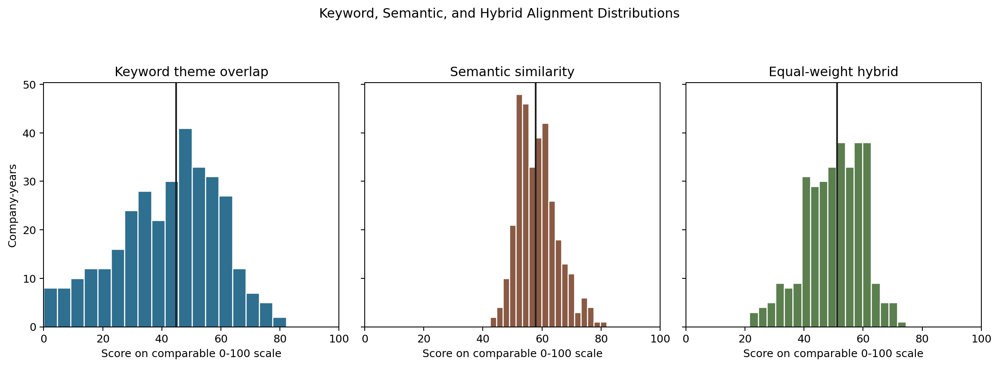
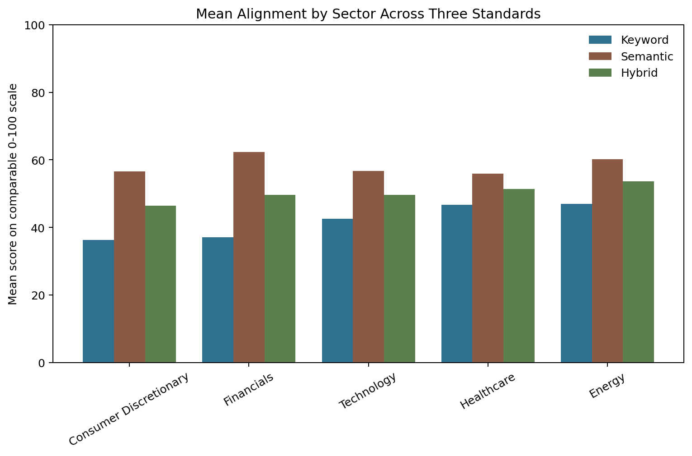
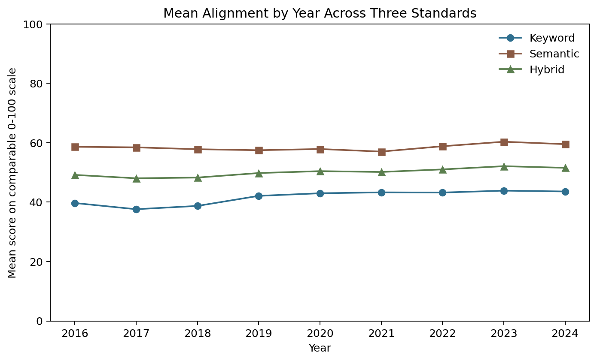
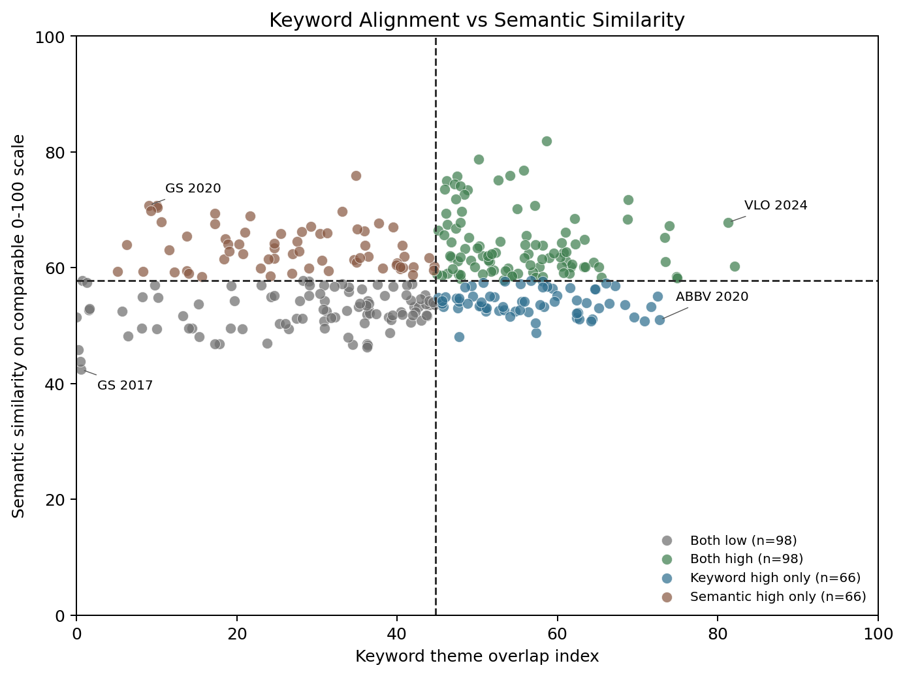

# Part 3 Summary

## Scope

Part 3 builds an Organizational Authenticity Index for the same 50 companies and 2016-2024 window
used in Parts 1 and 2. The index compares Part 1 stated-values pages with Part 2 SEC `DEF 14A`
proxy disclosures.

## Method

The measure treats authenticity as a disclosure-priority alignment proxy. For each company-year,
the pipeline converts Part 1 and Part 2 theme evidence into 12-theme distributions using the shared
`1.0.0-keyword-baseline` taxonomy. The main score is the overlap between those two normalized
distributions:

$$
A=100 \times \sum_{i=1}^{12}\min(s_i,d_i)
$$

where $A$ is the primary index, $s_i$ is the stated-values theme share for theme $i$, and $d_i$ is
the proxy-disclosure theme share for theme $i$.

This is not a direct measure of ethical behavior or lived culture. It measures whether the themes a
company publicly emphasizes on its stated-values page are also emphasized in its official proxy
disclosure. The interpretation follows the academic logic that authenticity perceptions depend on
congruence between stated and lived values, while disclosure and institutional theory caution that
formal claims can be symbolic or decoupled from activity. For this reason, a high score is evidence
of consistency across public values language and official disclosure emphasis; a low score is an
audit signal, not proof of hypocrisy.

Part 3 also reports a supplementary `semantic_text_similarity` measure. This uses
`sentence-transformers/all-MiniLM-L6-v2` to compare representative text windows from the stated
values page and proxy statement. It is a robustness check for broad semantic relatedness, not a
replacement for the primary keyword-taxonomy index.

## Coverage

The final panel retains all 450 company-years:

- 328 company-years are scored.
- 92 rows are missing because Part 1 is not usable.
- 16 rows are missing because Part 2 is not collected.
- 14 rows are usable in Part 1 and collected in Part 2 but have insufficient Part 1 theme signal.
- Semantic similarity is computed for 342 company-years because it only requires usable Part 1
  clean text and collected Part 2 clean text, not nonzero keyword-theme evidence.

## Findings

Across the 328 scored company-years, the mean authenticity index is 41.98 and the median is 44.83.
Scores range from 0.00 to 82.12, with an interquartile range from 30.81 to 55.14. This means the
typical company-year shows moderate rather than high alignment: less than half of the stated-values
theme emphasis is mirrored in the proxy-disclosure theme distribution for the median scored row.
The wide spread also shows that the index is not merely reproducing a generic corporate-language
baseline; it separates company-years with broad thematic consistency from those where the two
public artifacts emphasize very different values.

Sector averages also vary. Energy and Healthcare have the highest average alignment scores
(47.03 and 46.74), while Consumer Discretionary and Financials are lower on average
(36.31 and 37.08). These differences should be interpreted cautiously because sector vocabularies,
reporting norms, and Part 1 coverage differ. For this reason, the dataset also reports
sector-adjusted percentile ranks and z-scores for within-sector comparisons. The safest
interpretation is descriptive: sector patterns identify where alignment is higher or lower in this
sample, but they do not show that one sector is more behaviorally authentic than another.

The year summaries show modest upward movement after 2019, with average scores rising from 39.68 in
2016 to the low-to-mid 40s from 2019 through 2024. This is descriptive only; it does not establish a
causal relationship between external events and authenticity. The number of scored rows also rises
over time, from 24 in 2016 to 44 in 2024, so part of the apparent pattern may reflect better Part 1
coverage and more available evidence in later years.

Company-level summaries show useful case-study candidates. The highest average alignment among
companies with at least one scored year appears for Valero Energy (67.47), AbbVie (65.31),
Bristol-Myers Squibb (59.69), Marathon Petroleum (58.99), and IBM (58.95). The lowest averages
appear for Lowe's (13.47), Tesla (15.59), Target (16.69), Goldman Sachs (19.39), and NVIDIA
(20.84). These company averages should be read alongside `scored_years`; companies with fewer
scored years are less stable as longitudinal cases.

## Comparative Visual Analysis

For visualization, the semantic score is rescaled to a comparable 0-100 range:

$$
S_{0-100}=\frac{S+100}{2}
$$

where $S$ is the raw semantic cosine score scaled from $-100$ to $100$.

A descriptive hybrid score is then computed as:

$$
H=\frac{A+S_{0-100}}{2}
$$

where $H$ is the equal-weight hybrid, $A$ is the keyword authenticity index, and $S_{0-100}$ is the
rescaled semantic score. The hybrid is not the main index; it is an equal-weight comparison view.
On this shared scale, the keyword mean is 41.98, the semantic mean is 58.45, and the hybrid mean is
50.21.

The distribution comparison shows why the three standards should not be collapsed into one
unqualified measure. The keyword index has the widest spread, including near-zero audit targets and
high-alignment cases above 70. The semantic score is centered higher after rescaling but is more
compressed, which is expected for whole-text embeddings that capture broad corporate-language
relatedness even when theme priorities differ. The hybrid distribution falls between the two: it
moderates the lowest keyword cases when the texts are semantically related, but it also lowers some
high keyword cases when whole-text semantic similarity is less strong.

The sector comparison shows that keyword and semantic standards do not rank sectors identically.
Energy remains high under both keyword and semantic views, which makes its hybrid mean the highest
among sectors. Healthcare is high under the keyword index but lower under semantic similarity,
while Financials is low under keyword alignment but high under semantic similarity. That contrast
suggests Financials proxy statements and stated-values pages may share broad financial-services
language even when the specific values-theme distribution differs. This is exactly why the semantic
measure is useful as a supplementary diagnostic but not a replacement for the auditable keyword
index.

The year comparison preserves the keyword finding of a modest post-2018 increase, while showing
that semantic similarity is relatively flatter and generally higher on the shared scale. Hybrid
scores therefore move less sharply than the keyword index alone and sit around the high 40s to low
50s across the period. The figure supports a cautious interpretation: later years show somewhat
stronger keyword-theme alignment, but whole-text semantic relatedness is more stable and may partly
reflect common disclosure language across years.

The scatter plot makes the low correlation between keyword alignment and semantic similarity
visible. The dashed lines split the 328 scored rows into four median-based groups: 98 both-high
rows, 98 both-low rows, 66 keyword-high-only rows, and 66 semantic-high-only rows. Both-high cases
such as Valero 2024 combine strong taxonomy-theme overlap with strong whole-text semantic
relatedness, making them the clearest public-artifact consistency cases. Both-low cases such as
Goldman Sachs 2017 have weak values-theme overlap and weak semantic similarity, so they are strong
audit targets. Keyword-high-only cases such as AbbVie 2020 have shared taxonomy themes but lower
whole-text similarity, often because a values page and a proxy statement use different document
genres. Semantic-high-only cases such as Goldman Sachs 2020 have broad language similarity but weak
values-theme overlap, suggesting either generic sector language or taxonomy blind spots.

## Validity and Audit Checks

The robustness metrics define alternative ways to compare the two texts. This section interprets
what those checks show about measurement validity, artifact risk, and qualitative auditability.

The primary score is strongly correlated with cosine alignment ($r=0.919$) and with L1
alignment ($r=1.000$), which supports robustness across related vector-similarity
specifications. Binary Jaccard overlap is also correlated but weaker ($r=0.778$), confirming
that binary overlap is less informative when proxy statements mention most themes.

The primary score has near-zero correlation with Part 2 word count ($r=-0.046$), suggesting
that the normalized index is not mechanically driven by proxy-statement length.

Semantic text similarity is available for all 328 scored rows and has low correlation with the
primary index ($r=0.136$). Across the 342 rows where semantic similarity can be computed, the mean
semantic score is 16.38 and the median is 15.39. This low relationship is useful rather than
problematic: it indicates that the embedding-based whole-text comparison is capturing a different
signal from the deterministic theme-distribution overlap. Cases where the keyword score is low but
semantic similarity is higher may reveal synonymy or broad rhetorical similarity missed by the
taxonomy; cases where keyword alignment is high but semantic similarity is low may reflect shared
theme categories used in different textual contexts.

The case-audit file lists the 10 highest- and 10 lowest-scoring company-years for qualitative
review. These cases should be treated as audit targets rather than proof that a firm is authentic
or inauthentic. Additional qualitative notes are available in
[`case_audit_notes.md`](case_audit_notes.md).

The high-score cases are intuitive in a limited disclosure-alignment sense. Marathon Petroleum
and Valero company-years tend to pair stated leadership, shareholder, customer, or environmental
themes with proxy disclosures that also emphasize those themes. AbbVie and Bank of America also
appear among the high-alignment audit cases, where stated customer, employee, leadership, and
community themes are more visibly mirrored in the proxy text. Low-score cases tend to arise when
the stated-values evidence is very concentrated in one theme while the proxy disclosure emphasizes
a different set of themes. NVIDIA 2021 is the clearest example: the stated-values evidence is
concentrated in purpose/identity language, while the proxy statement emphasizes DEI, workforce, and
leadership themes. Microsoft 2017, Target 2019, Goldman Sachs 2017, and early Tesla years show
similar low-overlap patterns. These mismatches are useful for audit, but they are not proof of
hypocrisy or weak culture.

The qualitative audit notes also compare keyword-semantic divergence cases. This reinforces the
main design choice: the keyword index remains the primary auditable measure, while semantic
similarity helps identify cases where broad language similarity and values-theme overlap disagree.

## Limitations

The largest limitation is construct validity: proxy statements are official disclosure documents,
not direct observations of behavior. The score also depends on a deterministic keyword taxonomy,
which can miss synonyms or count boilerplate. Finally, missingness is not random: only 328 of 450
company-years are scored, and the non-scored rows should not be interpreted as low authenticity.
