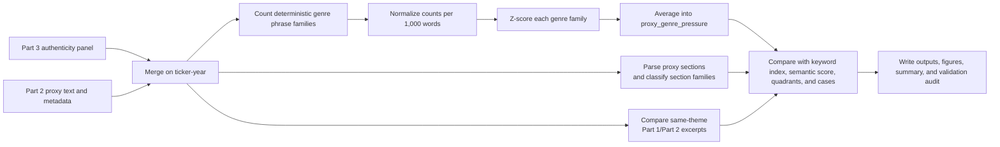

# Part 4 Methodology

## Construct

Part 4 has three diagnostic constructs. `proxy_genre_pressure` measures how strongly a `DEF 14A`
proxy statement reflects shareholder-meeting mechanics, governance boilerplate, and
legal-procedural language. `section_family` identifies which proxy sections carry the values-theme
evidence used in the Part 3 index. `theme_semantic_similarity` compares Part 1 and Part 2 evidence
excerpts inside the same taxonomy theme.

None of these is a replacement authenticity index. Together, they stress-test the Part 3 index.

## Workflow

## Phrase Families

The three phrase families are intentionally simple and auditable:

- `shareholder_mechanics`: annual meeting, voting, proxy cards, record dates, beneficial owners,
  quorum, and shareholder proposals.
- `governance_boilerplate`: board, committees, directors, independence, corporate governance, and
  executive compensation.
- `legal_procedural`: pursuant, accordance, regulation, securities, Exchange Act, solicitation,
  hereby, and related legal-form language.

The rate for each family is:

$$
R_f = 1000 \times \frac{C_f}{W}
$$

where `C_f` is the phrase count for family `f`, and `W` is the extracted proxy word count.

The composite score is:

$$
G = \frac{z(R_s) + z(R_g) + z(R_l)}{3}
$$

where `G` is `proxy_genre_pressure`, and the three z-scored rates represent shareholder mechanics,
governance boilerplate, and legal-procedural language.

## Interpretation Rules

High proxy genre pressure means the proxy statement is especially saturated with the language of
the `DEF 14A` genre. It does not mean the disclosure is bad, misleading, or less substantive. A
negative association between genre pressure and authenticity would suggest that the Part 3 index
may partly penalize company-years whose proxy statements are more procedural. A weak association
would support the claim that low scores are not merely a proxy-template artifact.

## Section-Level Proxy Parsing

The section parser uses line-level heading heuristics rather than company-specific templates. A
line is treated as a candidate heading when it is short, heading-like, and either contains a known
section phrase or has title/uppercase structure. Text between adjacent headings becomes a section.
If a filing yields too few headings, the parser falls back to fixed-size text chunks and classifies
those chunks by content.

Each section is assigned to one of these families: `meeting_voting`, `governance_board`,
`compensation`, `shareholder_proposals`, `ownership`, `audit`, `human_capital_values`,
`legal_other`, or `other`.

For each section, the output stores word count, share of proxy text, genre count/rate, total
taxonomy-theme matches, dominant theme, and per-theme counts. This makes it possible to see whether
values evidence is concentrated in procedural sections or in more substantive governance,
workforce, sustainability, and values-related spans.

## Theme-Level Semantic Comparison

The theme-semantic layer uses the upstream `theme_evidence` fields from Parts 1 and 2. For each
company-year and each of the 12 taxonomy themes, it collects bounded evidence excerpts from the
stated-values page and proxy statement. If both sides have evidence for the same theme, it compares
the local excerpt texts.

The primary comparison uses `sentence-transformers/all-MiniLM-L6-v2`, matching the Part 3 semantic
robustness model family. If that model cannot be loaded locally, the code falls back to a
deterministic TF-IDF unigram/bigram cosine score and records the fallback method. Rows where one or
both sides lack evidence remain in the output with explicit status fields.

## Case Audit Logic

The case-audit table separates four groups using only the two primary alignment diagnostics:
Organizational Authenticity Index (OAI) and whole-text semantic similarity (SS):

- low OAI and low SS;
- low OAI and high SS;
- high OAI and low SS;
- high OAI and high SS.

Proxy genre pressure remains in the output as an auxiliary diagnostic column, but it does not
define the case type. These buckets are designed for follow-up qualitative review, not final
classification.
