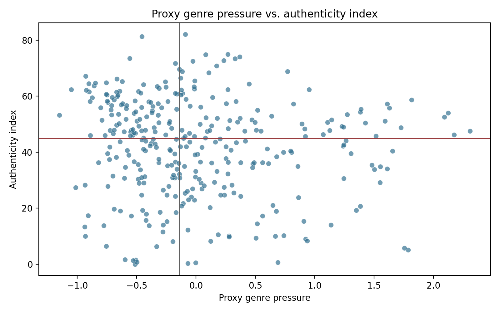
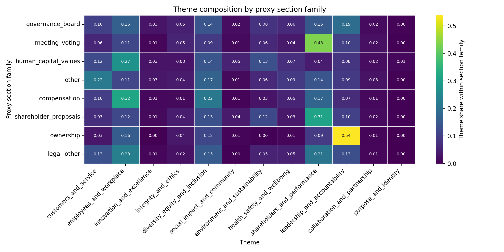
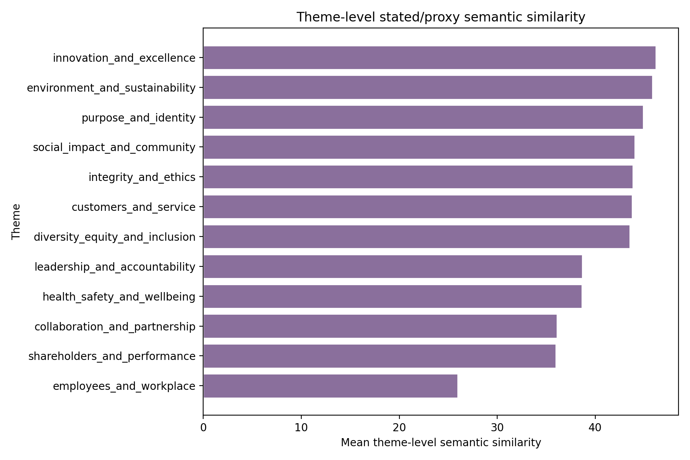
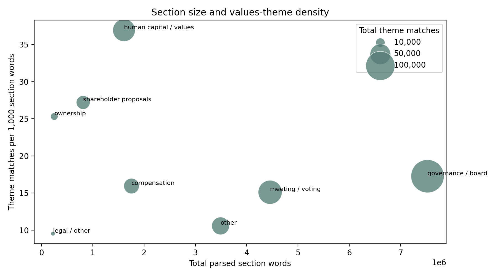
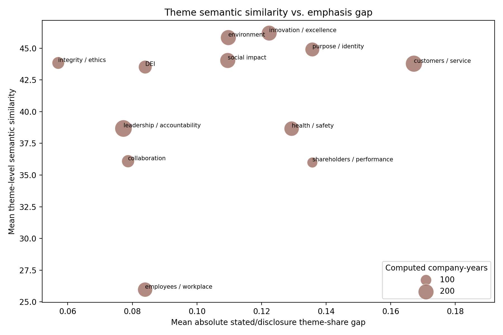

# Part 4 Summary

## Research Questions

Part 4 extends the Part 3 validity checks into three numbered research questions:

1. **Whole-document genre sensitivity:** Is the Part 3 authenticity index sensitive to the
   overall genre pressure of `DEF 14A` proxy statements?
2. **Section-level evidence location:** Which proxy sections carry the values-theme evidence used
   in the alignment measure?
3. **Theme-level semantic comparability:** When the same theme appears in both stated-values pages
   and proxy statements, is the local evidence language actually semantically similar?

## Method

The analysis keeps the same 450 company-year panel used in Parts 1-3. For each collected proxy
statement, it counts three families of deterministic proxy-genre phrases:

- shareholder-meeting mechanics;
- governance boilerplate;
- legal and procedural language.

Each family is normalized per 1,000 words. The three normalized rates are z-scored and averaged
into `proxy_genre_pressure`, where higher values mean the proxy statement is more dominated by
the genre language typical of `DEF 14A` filings.

The section-level layer heuristically parses proxy text into section-like spans and classifies each
span into families such as meeting/voting, governance/board, compensation, shareholder proposals,
ownership, audit, human-capital/values, legal/other, or other. The theme-level semantic layer
compares Part 1 and Part 2 evidence excerpts within each taxonomy theme using MiniLM embeddings
when available, with a TF-IDF fallback if the embedding model cannot load.

## Coverage

- Target company-years retained: 450.
- Proxy genre diagnostics computed: 434.
- Scored authenticity rows available for comparison: 328.
- Parsed proxy section rows: 127630.
- Theme-level comparison rows: 2099 computed theme-company-years.
- Mean proxy genre pressure among computed proxy rows: -0.000.
- Mean authenticity index among scored rows: 41.98.

## Findings

### Finding 1. Proxy genre pressure is a modest measurement risk, not the main explanation

The first diagnostic computes correlations between `proxy_genre_pressure` and Part 3 alignment
metrics. Proxy genre pressure has a Pearson correlation of -0.093 with the authenticity
index and a Spearman correlation of -0.141. This is a weak relationship, so the
safest conclusion is that genre pressure is a measurement-risk signal, not the main driver of the
index.

The tercile comparison points in the same direction. Mean authenticity is
44.19 in the low genre-pressure tercile and
39.70 in the high genre-pressure tercile, a difference of
4.48 points. In a descriptive
fixed-effects regression with proxy word count, sector indicators, and year indicators, the
coefficient on `proxy_genre_pressure` is -2.764 with an $R^2$ of
0.096. This is not a causal estimate, but it shows that the weak
negative pattern survives basic document-length, sector, and year context.

The figure is useful as a diagnostic check rather than as the main evidence. It shows wide
dispersion at nearly every level of proxy genre pressure: highly procedural proxy statements can
still have moderate or high alignment, and low-alignment cases also appear outside the
highest-genre region. Therefore, low authenticity scores should not be automatically dismissed as
template effects, but high-genre/low-score cases should be routed to section-level review.

Genre pressure is correlated with rescaled semantic similarity at 0.179 and with
keyword-minus-semantic divergence at -0.159. This matters because Part 3 showed that
keyword theme alignment and broad embedding similarity capture different signals. If high-genre
proxy statements look semantically similar while receiving lower keyword alignment, that pattern is
consistent with embeddings picking up generic corporate/proxy language while the taxonomy-based
index still identifies weak values-priority overlap.

### Finding 2. Section-level parsing shows where proxy evidence is coming from

The second diagnostic parses the proxy statements into section-like spans and aggregates values
theme evidence by section family. This produces 127630
section rows across 434 company-years. The largest raw
source of values-theme evidence is `governance_board`, with
129840 total theme matches. `meeting_voting` is next with
67,314 matches, followed by `human_capital_values` with 59,405 matches.

Raw volume and density tell different stories. `governance_board` contributes the most total
evidence because it is very large: 7,523,017 parsed words. But the
densest values-language section family is `human_capital_values`, with
36.91 theme matches per 1,000 section words. This
is why section-level parsing matters: the index draws a lot of evidence from governance machinery,
while the most concentrated values language appears in more explicitly values-oriented sections.

The heatmap is the most diagnostic section-level figure. Each row is a proxy section family, and
each annotated cell reports the within-section-family share of values-theme matches assigned to a
theme. Read it row by row: the values in a row sum to approximately 1.00, so darker and larger
numbers identify the dominant themes within that section family. This is a composition plot, not a
raw-count plot. The figure shows that proxy evidence is not evenly distributed across sections:
governance and meeting/voting sections carry substantial theme evidence, but the composition of
that evidence differs by section family. This matters because a theme match in a governance-board
section may mean something different from the same theme match in a human-capital/values section.

### Finding 3. Same-theme semantic comparability varies sharply by theme

The third diagnostic compares Part 1 and Part 2 evidence excerpts within the same taxonomy theme.
It computes MiniLM semantic similarity for 2099 company-year-theme pairs where
both sides have evidence. This is a stricter check than whole-text semantic similarity because it
asks whether the local language attached to the same theme label is actually similar.

The highest mean local semantic similarity is `innovation_and_excellence` at
46.19, followed closely by
`environment_and_sustainability` at 45.83. The lowest is `employees_and_workplace` at
25.96. The largest mean stated/disclosure emphasis gap
appears for `customers_and_service` at 0.167.

The figure shows that theme labels are not interchangeable measurement units. Innovation,
environment/sustainability, purpose/identity, and social-impact evidence tends to be more locally
similar across stated-values pages and proxy disclosures. By contrast, employees/workplace has the
lowest local semantic similarity. A likely interpretation is that stated-values pages often discuss
employees as culture, people, and mission, while proxy statements often discuss employees through
compensation, governance, workforce-risk, or human-capital disclosure language.

### Supplementary diagnostic figures

The two bubble plots are useful as secondary diagnostics. They are not the main evidence for the
findings above, but they make two measurement tradeoffs easier to inspect.

This plot explains the section-level distinction between evidence volume and evidence density. The
x-axis is total parsed words for each section family, the y-axis is values-theme matches per 1,000
section words, and bubble size is total theme matches, with the legend giving reference bubble
sizes. It shows why `governance_board` dominates raw evidence while `human_capital_values` is the
most values-dense section family.

This plot explains the theme-level distinction between semantic comparability and emphasis
alignment. The x-axis is the mean absolute stated/disclosure theme-share gap, the y-axis is
mean theme-level semantic similarity, and bubble size is the number of computed company-years for
that theme. It shows that themes can differ in quantity and meaning at the same time: a theme can
have a large emphasis gap but still be locally semantically similar, or have a smaller emphasis gap
while using different local language across the two source types.

## Interpretation

Part 4 should be read as a stress test for the authenticity measure. The whole-document genre layer
asks whether low scores are plausibly template-driven. The section layer shows where in the proxy
the measured values evidence appears. The theme-semantic layer checks whether shared theme labels
actually refer to similar local language across the stated-values page and proxy statement.

## Limitations

The genre dictionaries are transparent but incomplete. They identify common proxy-statement
language; they do not perfectly separate boilerplate from substantive governance discussion. The
analysis is also exploratory and descriptive. It does not prove that proxy genre causes low
alignment, nor does it prove that low-genre, low-alignment cases reflect actual organizational
inauthenticity.
